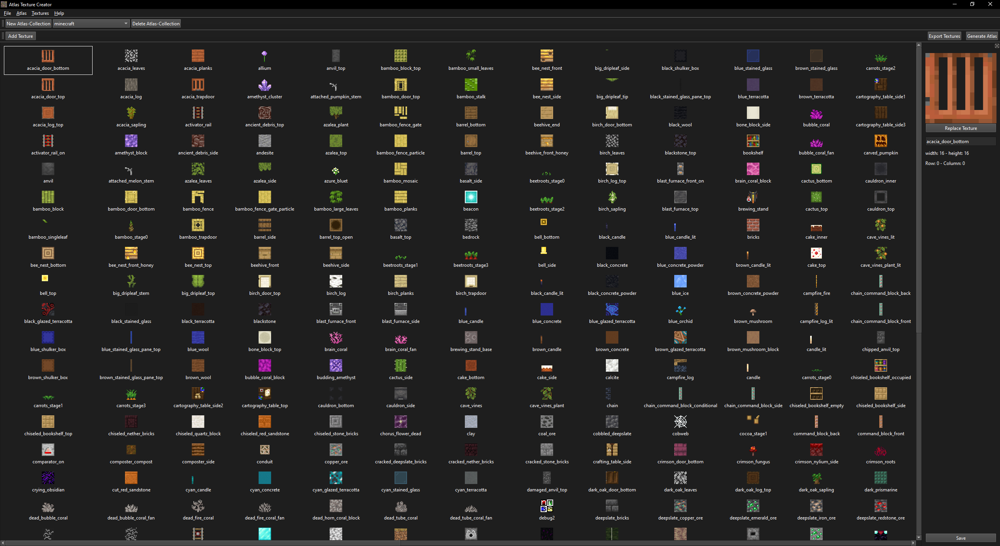

# 🖼️ Atlas Texture Creator GUI

## Overview

**Atlas Texture Creator GUI** is a powerful desktop application tailored for **game developers**, **digital artists**, and **texture artists**. It simplifies the process of creating and managing texture atlases — large images composed of multiple smaller textures.

---

## 🚀 Features

### 🗂️ Atlas Collection Management
- Create and organize multiple texture collections with ease
- Quickly add, remove, and edit textures
- Support for project-specific organization

### 🧩 Texture Atlas Generation
- Automatically generate optimized atlases from selected collections
- Smart packing algorithms to minimize space and waste
- High-fidelity texture merging with support for common image formats
- Maintain original image quality and properties

### 📤 Export Options
- Export entire collections
- Save generated atlases as image files with associated JSON metadata (coordinates, sizes, etc.)
- Ensure consistent quality and compatibility across game engines or pipelines

---

## 🎯 Use Cases

### 🎮 Game Development
- Generate sprite sheets for 2D games
- Optimize texture memory for 3D environments
- Streamline UI texture management

### 🧱 Graphics & Web Applications
- Consolidate UI components into a single texture for web or desktop apps
- Efficient texture packaging for performance-critical environments

### 📁 Asset Organization
- Categorize and manage large texture libraries
- Quickly access and reuse frequently used collections

---

## ⚙️ Technical Details

- Built with **Python** and **PySide6** for cross-platform support
- **Modular architecture** designed for extensibility and maintainability
- **Event-driven UI** for responsive and fluid interactions
- Strong data modeling using **Pydantic** for type safety and validation

---

## 📸 Screenshot

---

## 💡 Why Use This Tool?

Atlas Texture Creator GUI is designed to **streamline your texture workflow**, reducing manual steps and ensuring your atlases are optimized for performance. Whether you're working on indie games, commercial software, or personal art projects, this tool helps you stay organized and efficient.
